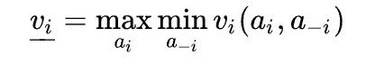
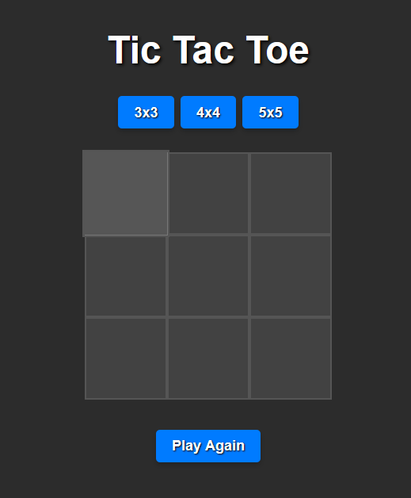

# Tic-Tac-Toe with Minimax Algorithm

This project implements a Tic-Tac-Toe game that uses the **Minimax Algorithm** to always play the optimal moves in a 3x3 grid. The project is built using Python, HTML, CSS, and JavaScript, showcasing game logic for two players with an interactive UI.

## Table of Contents
- [Project Overview](#project-overview)
- [Minimax Algorithm](#minimax-algorithm)
- [Features](#features)
- [Tech Stack](#tech-stack)

## Project Overview

This Tic-Tac-Toe game was developed as an individual project to experiment with and demonstrate the use of the **Minimax Algorithm**. The goal of the project is to create an unbeatable AI player for Tic-Tac-Toe by always finding the best possible move. The game logic ensures that the AI will either win or tie every match.

- **Hosting**: The project is hosted using PythonAnywhere.
- **Development Framework**: The backend uses the Django framework.

## Minimax Algorithm

The **Minimax Algorithm** is a decision-making algorithm used in turn-based games to find the optimal move by simulating all possible game states. The algorithm operates by assuming both players (the AI and the opponent) play optimally.

### How It Works:

1. **Maximizing Player**: This is the AI, which tries to maximize its score by picking the best possible move.
2. **Minimizing Player**: This is the human opponent, whose objective is to minimize the AI's score.
3. The algorithm simulates each possible move, recursively determining the outcome of each move until the end of the game (win, lose, or draw).
4. **Formula**:
   
   
   
   The formula shows that the AI selects the move \( a_i \) that maximizes its chances while assuming the opponent selects the move \( a_{-i} \) that minimizes the AI’s chances.

   - **Max Function**: Chooses the maximum possible gain for the AI.
   - **Min Function**: Simulates the opponent picking the move that minimizes the AI’s advantage.
  
Below is an empty game grid for the Tic-Tac-Toe:

Below is the example of a game where player O wins (Bot):

### Why Minimax in Tic-Tac-Toe?

In Tic-Tac-Toe, the Minimax Algorithm explores all possible game states to ensure that:
- The AI always wins or forces a draw.
- It avoids any losing moves.

This is especially useful for simple games like Tic-Tac-Toe, where all possible moves can be simulated due to the limited number of game states.

## Features

- Interactive Tic-Tac-Toe game that you can play against an AI opponent.
- AI player utilizes the Minimax Algorithm to ensure optimal gameplay.
- Supports 3x3 grid format with the potential for expansion to 4x4, 5x5 grids.
- Visual and user-friendly game interface.

## Tech Stack

- **Python**: Used for backend logic and game management.
- **HTML/CSS/JavaScript**: Frontend for building the game interface and implementing the Minimax algorithm.
- **Django**: Backend framework for web hosting.
- **Hosting**: PythonAnywhere for deployment.
